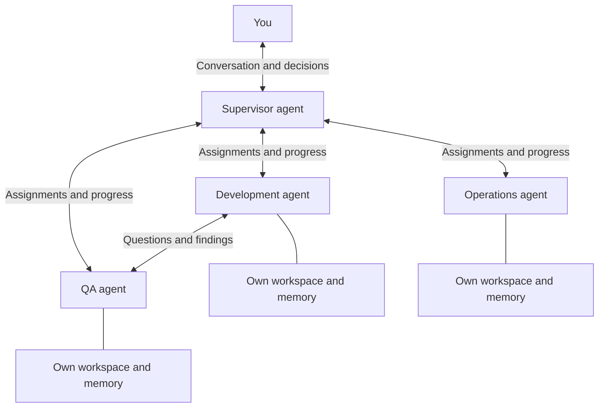
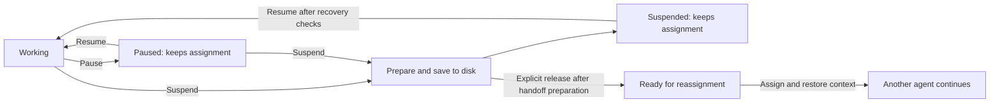

> **Under development**

# NimbleNewt

  

NimbleNewt lets you run a persistent team of AI agents from your computer. You talk with them to develop ideas, assign work, ask questions, and decide priorities. Agents coordinate with each other and keep track of their work across conversations, interruptions, and restarts.

It supports **macOS, Linux, and Windows**, with configurable local and cloud models.

## Your team at a glance

You can talk to the supervisor or any agent directly. This is one example team; roles are configurable.

## How it works

- **You direct the team through conversation.** Talk to an agent or supervisor to plan a project, get help, or ask what’s happening. Your decisions take precedence over the agents’ recommendations.
- **Agents have roles and responsibilities.** Supervisors coordinate specialists in development, QA, operations, research, marketing, support, design, and documentation. They handle both individual tasks and ongoing responsibilities.
- **Each agent has its own workspace and memory.** Its “desk” holds its history, current work, and next steps. Agents can read authorized team records and ask each other questions, while keeping private scratch notes and their own environments.
- **Work can be interrupted and resumed.** Agents switch between tasks and conversations while retaining the context needed to return. Pause retains assignments and allows background jobs to continue. Suspend prepares and saves work to disk so it can survive a reboot. Suspend and Release also prepares it for another agent to take over.
- **The team meets and plans.** Scheduled stand-ups let agents report progress, discuss problems, and propose improvements. You can join, call a meeting, or catch up through a summary and full transcript. Votes include short reasons; unattended decisions stay within your delegated authority.
- **Models match the work.** Task difficulty selects a configurable model profile. Ordered backup models handle provider outages or planned maintenance, subject to your permissions and data-sharing settings.
- **Agents improve their tools.** They can develop skills and tools in their own environments. Authorized maintainers review useful additions for a shared toolbox. Budgets balance delivering work with improving how the team works.
- **You can review what happened.** Conversation history, tool activity, results, and recorded decisions make work inspectable. Agents check their own work, with independent QA where required.

## Pause, come back, or hand off

Pausing keeps work assigned to the same agent. Suspension takes time to prepare and save resumable work; releasing it for another agent is an explicit choice.

Saved work survives restarts. Existing permitted background jobs may continue during Pause; Suspend settles or checkpoints them as part of preparation.

## Your projects, your rules

One human owner directs each installation. NimbleNewt works across multiple repositories and services without requiring special files in those repositories. Its internal records stay separate from the work you submit to your organization or an open-source project.

Scoped permissions, isolated agent environments, protected files, and approval rules control what agents can change. Each installation is configurable rather than tied to a particular provider or private infrastructure.

## Under the hood

A controller manages tasks, permissions, communication, model routing, and persistent records. Harness adapters run the agents, with **Pi Durable** selected as the initial runtime direction.

## More detail

- [Full design and document guide](docs/nimblenewt/README.md)
- [Accepted decisions and open questions](docs/nimblenewt/design-decisions.md)
- [Harness evaluation results](docs/nimblenewt/harness-test-results.md)
- [Reproducible harness experiments](benchmarks/nimblenewt-harness/README.md)
